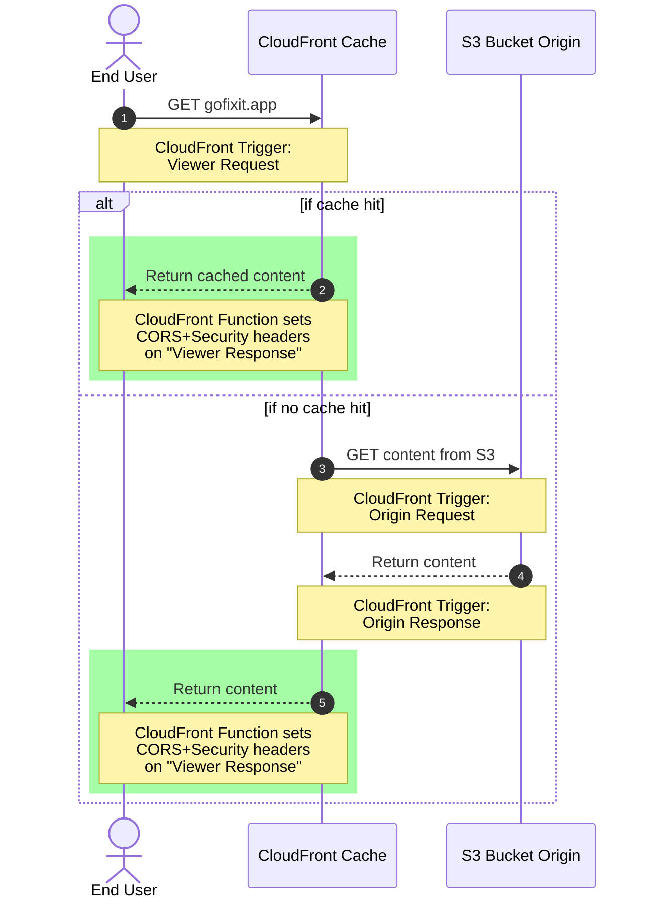

Fixit is a SaaS product that provides users with powerful tools for managing maintenance and repair workflows, including in-app payments powered by [Stripe](https://stripe.com/). This repo is home to the Fixit web app – a [React](https://reactjs.org/) SPA that provides core services and features to Fixit users.

Author: [Trevor Anderson](https://github.com/trevor-anderson), Founder of [Nerdware](https://github.com/Nerdware-LLC)

&nbsp;
[![Test Workflow][test-status-badge]](https://github.com/Nerdware-LLC/fixit-web/actions/workflows/test.yaml "View Test Workflow")
&nbsp;
[![React][react-badge]](https://reactjs.org/ "reactjs.org")
&nbsp;
[![Material UI][mui-badge]](https://mui.com/material-ui/ "mui.com/material-ui")
&nbsp;
[![Apollo Client][apollo-badge]](https://www.apollographql.com/docs/react/ "apollographql.com/docs/react")
&nbsp;
[![Chart.js][chartjs-badge]](https://www.chartjs.org/ "chartjs.org")
&nbsp;
[![pre-commit][pre-commit-badge]](https://pre-commit.com "pre-commit.com")
&nbsp;
[![semantic-release][semantic-badge]](https://github.com/semantic-release/semantic-release "github.com: semantic-release")
&nbsp;
[![License: Proprietary][license-badge]](/LICENSE "View License")

<!--   BADGE LINKS   -->

[test-status-badge]: https://github.com/Nerdware-LLC/fixit-web/actions/workflows/test.yaml/badge.svg
[react-badge]: https://img.shields.io/badge/React-v18-61DAFB.svg?logo=react&logoColor=61DAFB&labelColor=gray
[mui-badge]: https://img.shields.io/badge/Material--UI-v5-0081CB.svg?logo=mui&logoColor=0081CB&labelColor=gray
[apollo-badge]: https://img.shields.io/badge/Apollo_Client_v3-311C87.svg?logo=apollo-graphql&labelColor=gray
[chartjs-badge]: https://img.shields.io/badge/Chart.js_v4-FF6384.svg?logo=chart.js&labelColor=gray
[pre-commit-badge]: https://img.shields.io/badge/pre--commit-F8B424.svg?logo=pre-commit&logoColor=F8B424&labelColor=gray
[semantic-badge]: https://img.shields.io/badge/%20%20%F0%9F%93%A6%F0%9F%9A%80-semantic--release-blue.svg
[license-badge]: https://img.shields.io/badge/license-Proprietary-000080.svg?labelColor=gray

 

- [🗺️ Project Overview](#️-project-overview)
- [☁️ Content Delivery](#️-content-delivery)
  - [CloudFront](#cloudfront)
- [📦 CI/CD Pipeline](#-cicd-pipeline)
  - [GitHub Actions](#github-actions)
  - [Git Workflow](#git-workflow)
  - [Codegen](#codegen)
- [📝 License](#-license)
- [💬 Contact](#-contact)

## 🗺️ Project Overview

The Fixit web app is a [React](https://reactjs.org/) SPA that provides core SaaS services and features to Fixit users, including in-app payments powered by [Stripe](https://stripe.com/).

> [!NOTE]
>
> ### Quick Links
>
> <table align="center">
>   <tr>
>   <td align="center">
>
> 
>
> [<code>Fixit Frontend</code> <code>Component Storybook</code>](https://main--659981450c81cefabec86fa2.chromatic.com "Check out the Fixit front-end Storybook on Chromatic")
>
>   </td>
>   <td align="center">
>
> 
>
> [<code>Fixit API</code> <code>GitHub Repo</code>](https://github.com/Nerdware-LLC/fixit-api#readme "Check out the Fixit API GitHub repo")
>
>   </td>
>   <td align="center">
>
> 
>
> [<code>Fixit REST API OpenAPI</code> <code>Schema Explorer</code>](https://app.swaggerhub.com/apis/Nerdware/Fixit "Check out the REST API OpenAPI Schema on SwaggerHub")
>
>   </td>
>   <td align="center">
>
> 
>
> [<code>Fixit GraphQL API</code> <code>Schema Explorer</code>](https://studio.apollographql.com/public/fixit/variant/current "Check out the GraphQL API Schema-Explorer on Apollo Studio")
>
>   </td>
>   </tr>
> </table>

## ☁️ Content Delivery

As with all Fixit cloud infrastructure, IaC files responsible for _defining_ and _implementing_ Fixit's cloud architecture/resources are split between two sibling repos:

- [**fixit-cloud-modules**](https://github.com/Nerdware-LLC/fixit-cloud-modules#readme) &nbsp; Terraform modules which _define_ Fixit cloud resources.
- [**fixit-cloud-live**](https://github.com/Nerdware-LLC/fixit-cloud-live#readme) &nbsp;&nbsp;&nbsp; Terragrunt configs which _implement_ Fixit cloud resources.

### CloudFront

Fixit Web is delivered to end users via the process outlined in the diagram below.

## 📦 CI/CD Pipeline

<!-- An outline of this process is below. -->

<!-- TODO Add screenshot image of pipeline_production workflow in action -->

### GitHub Actions

This project's CI/CD pipeline uses GitHub Actions to [test](/.github/workflows/test.yaml), [release](/.github/workflows/release.yaml), and [deploy](/.github/workflows/deploy.yaml) code changes.

1. [`Test`](/.github/workflows/test.yaml) - Runs test suites, adds test and coverage info to PRs, and updates [CodeCov](https://about.codecov.io/).
2. [`Release`](/.github/workflows/release.yaml) - Creates a new GitHub release using [Semantic Release](https://github.com/semantic-release/semantic-release#readme).
3. [`Deploy`](/.github/workflows/deploy.yaml) - Creates the relevant build, uploads it to an [AWS S3 bucket](https://docs.aws.amazon.com/s3/), and invalidates the [CloudFront](https://docs.aws.amazon.com/cloudfront/) cache.

### Git Workflow

This project uses uses [GitHub Flow](https://guides.github.com/introduction/flow/) to deploy two live environments - staging and production - both of which are associated with a Git branch for releases:

| Environment | Release Branch |                   Permits `git push`                   |
| :---------- | :------------: | :----------------------------------------------------: |
| staging     |      next      | ✓ |
| production  |      main      |                           ❌                           |

Project versioning and the [CHANGELOG.md](./CHANGELOG.md) are managed automatically via GitHub Actions and [Semantic Release](https://github.com/semantic-release/semantic-release#readme).

For more information on how new code is integrated and deployed, check out the guide to [CONTRIBUTING](./CONTRIBUTING.md).

### Codegen

TypeScript types are generated using [GraphQL Code Generator](https://graphql-code-generator.com/) and the [Fixit GraphQL schema](/fixit%40current.graphql). The same generated types are used throughout the entire Fixit stack.

When the [Fixit GraphQL schema](/fixit%40current.graphql) is updated during API development, changes are automatically pushed to [Apollo Studio](https://www.apollographql.com/), thereby enabling every component of the stack to use the latest version of the schema (or any particular previous version, if necessary). The schema changes are pulled into other Fixit repos using [Rover GitHub Actions](https://www.apollographql.com/docs/rover/ci-cd/#github-actions), but can also be pulled imperatively using the [Rover CLI](https://www.apollographql.com/docs/rover/).

## 📝 License

All files, scripts, and source code contained herein are for proprietary use only by Nerdware, LLC.

See [LICENSE](/LICENSE) for more information.

## 💬 Contact

Trevor Anderson — [Trevor@Nerdware.cloud](mailto:trevor@nerdware.cloud) — [@TeeRevTweets](https://twitter.com/teerevtweets)

&emsp;

&emsp;

&emsp;

[**_Dare Mighty Things._**](https://www.youtube.com/watch?v=GO5FwsblpT8)

